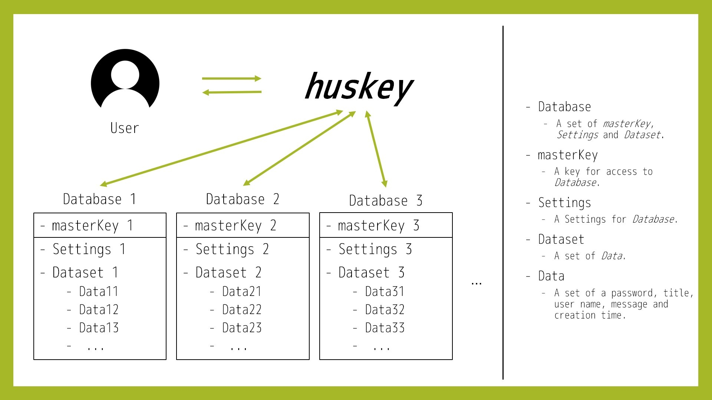

# huskey

## huskey とは？

**huskey** は、ターミナル上でパスワードが管理できる、Java 製クロスプラットフォーム・CUI パスワードマネージャーです。

## アーキテクチャ

- Database
    - masterKey, Settings, Dataset をまとめたもの
- masterKey
    - データベースへのアクセスに必要なキー
- Settings
    - パスワード生成等のデータベースの設定
- Dataset
    - Data の集合
- Data
    - タイトル、ユーザー名、パスワード、メッセージ、作成/更新日時を持つもの

## コマンド

"\*" が付いた引数は可変長です。

丸括弧で囲まれた引数は省略可能です。

"\|" が付いた引数は、その内のどれかを指定する必要があります。

以下のコマンドは変更される可能性があります。

### General

| Commands                 | Description                                                                                                 |
| :----------------------- | :---------------------------------------------------------------------------------------------------------- |
| huskey help (\<command>) | huskey のコマンドとそれらの解説の一覧を表示する。\<command>が入力された場合、そのコマンドの詳細を表示する。 |

### Config

Config とは、huskey 全体に適用される共通の設定のこと。状態は _~/.huskey/config.xml_ に保持される。

| Commands                 | Description                   |
| :----------------------- | :---------------------------- |
| huskey config \[options] | config.xml の内容を変更する。 |

### Database

| Commands                                   | Description                                           |
| :----------------------------------------- | :---------------------------------------------------- |
| huskey init \<new_database>                | 新しいデータベースを作成する。                        |
| huskey change key\|settings \[options]     | データベースの _masterKey_ や _Settings_ を変更する。 |
| huskey database                            | データベースの一覧と、既定のデータベースを表示する。  |
| huskey database --delete=\<database>       | \<database> を削除する。                              |
| huskey merge \<database_1> (\<database_2>) | \<database_1> を \<database_2> にマージする。         |

### Dataset

| Commands               | Description                             |
| :--------------------- | :-------------------------------------- |
| huskey list \[options] | データベース内の _dataset_ を表示する。 |

### Data

| Commands                            | Description                           |
| :---------------------------------- | :------------------------------------ |
| huskey get \<title> \[options]      | \<title> の _data_ を取得する。       |
| huskey set \<title> \[options]      | \<title> の _data_ を追加・更新する。 |
| huskey remove \*\<title> \[options] | \*\<title> _data_ を削除する。        |

## Contribution

このプロジェクトでは、共同開発に初めて挑戦する方を特に歓迎します（もちろん経験者も！）。  
Issue の中にはプログラミング初心者の方でもこなせるものも多く存在しますので、興味のある方はぜひご参加ください。

開発のガイドについては [/.github/contribute.md](https://github.com/denx-official/huskey/blob/main/.github/contribute.md)、コーディング規約については [/.github/codingstyle.md](https://github.com/denx-official/huskey/blob/main/.github/codingstyle.md) をご覧ください。
